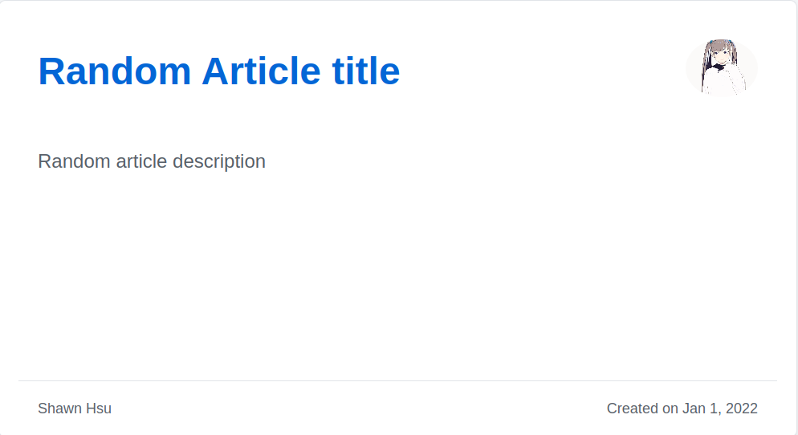

# autogen-og-image
autogen-og-image is a highly customizable [Open Graph](https://ogp.me/) image generator for your blog, specifically for [mmistakes/minimal-mistakes](https://github.com/mmistakes/minimal-mistakes)


## Description


This tool will generate the [Open Graph](https://ogp.me/) image based on the `frontmatter` section in your markdown article

What is a frontmatter?
```
---
title: Random Article Title
description: Random article description
---
```

<hr>

For this tool, the `frontmatter` must have the following attributes

|Required|`title`|`description`|`date`|
|:--:|:--:|:--:|:--:|
|Optional|`author`|`avatar`||

## Environment Variable
This tool also support environment variable as input\
You can find various config in [.env.example](./.env.example)

Just copy to a new file `.env` and make some changes, you're good to go
```shell
$ cp .env.example .env
```

## Run
```shell
$ npm run build
$ node ./dist/main.js
```

## References
+ [A framework for building Open Graph images](https://github.blog/2021-06-22-framework-building-open-graph-images/)
+ [agneym/generate-og-image](https://github.com/agneym/generate-og-image)

## License
This project is licensed under GNU General Public License v3.0 License - see the [LICENSE](./LICENSE) file for detail
